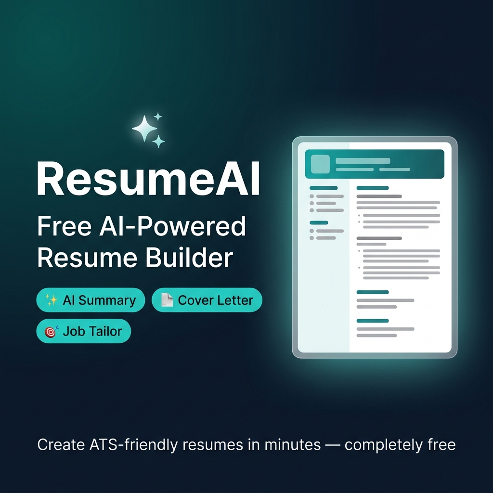

# ResumeAI 🚀

> A full-stack, AI-powered resume builder designed to help users create ATS-optimized, professional resumes in minutes.



## 🌟 Features

- **🧠 AI-Powered Enhancements**: Instantly generate professional summaries, improve bullet points, and create tailored cover letters using OpenAI.
- **🎯 Job Tailoring**: Paste a job description and let the AI analyze your resume against it, suggesting keywords to beat the ATS (Applicant Tracking System).
- **🎨 Premium Templates**: Choose between Modern, Minimalist, and Professional templates. Customize accent colors to match your personal brand.
- **📱 Responsive UI**: A fully mobile-friendly sidebar navigation and drag-and-drop builder experience.
- **💾 Auto-Save**: Never lose your progress. Your resume automatically saves to the database as you type.
- **📄 High-Quality PDF Export**: Download your finished resume as a perfectly formatted PDF.
- **🔒 Secure Authentication**: Robust JWT-based user authentication and secure password hashing.
- **🖼️ Dashboard Previews**: Manage multiple resumes with beautiful mini-thumbnail previews and completion progress bars.
- **🔍 SEO Optimized**: Full metadata, Open Graph cards, Twitter cards, and JSON-LD structured data for optimal search engine visibility.

## 🛠️ Tech Stack

### Frontend
- **React 18** (Vite)
- **TypeScript**
- **Tailwind CSS** (Styling)
- **Zustand** (State Management)
- **React Router v6** (Navigation)
- **Lucide React** (Icons)
- **html2canvas & jsPDF** (PDF Generation)

### Backend
- **Node.js & Express**
- **TypeScript**
- **MongoDB & Mongoose** (Database)
- **JSON Web Tokens (JWT)** (Authentication)
- **OpenAI API** (AI Features)

---

## 🚀 Getting Started

### Prerequisites
Make sure you have [Node.js](https://nodejs.org/) and [MongoDB](https://www.mongodb.com/) installed on your machine. You will also need an [OpenAI API Key](https://platform.openai.com/).

### Installation

1. **Clone the repository:**
   ```bash
   git clone https://github.com/utsav9904/ai-resume.git
   cd ai-resume
   ```

2. **Setup the Backend (Server):**
   ```bash
   cd server
   npm install
   ```
   Create a `.env` file in the `server` directory and add the following variables:
   ```env
   PORT=5000
   MONGODB_URI=mongodb://127.0.0.1:27017/resume-builder
   JWT_SECRET=your_super_secret_jwt_key
   OPENAI_API_KEY=your_openai_api_key_here
   ```
   Start the backend server:
   ```bash
   npm run dev
   ```

3. **Setup the Frontend (Client):**
   Open a new terminal window:
   ```bash
   cd client
   npm install
   ```
   Create a `.env` file in the `client` directory:
   ```env
   VITE_API_URL=http://localhost:5000
   ```
   Start the frontend development server:
   ```bash
   npm run dev
   ```

4. **Open your browser:**
   Navigate to `http://localhost:5173` to see the application running.

---

## 📂 Project Structure

```
ai-resume/
├── client/                 # Frontend React Application
│   ├── public/             # Static assets (Favicon, OG Image, SEO files)
│   └── src/
│       ├── components/     # Reusable UI components & Resume Templates
│       ├── context/        # React Context (AuthContext)
│       ├── pages/          # Page views (Landing, Builder, Dashboard, Auth)
│       ├── services/       # API integration logic
│       ├── store/          # Zustand global state (useResumeStore)
│       └── utils/          # Helpers (PDF export)
│
└── server/                 # Backend Express Application
    ├── middleware/         # Custom middlewares (auth, validation)
    ├── models/             # Mongoose schemas (User, Resume)
    ├── routes/             # API routes (Auth, Resume, AI)
    └── server.ts           # Entry point
```

---

## 🤝 Contributing

Contributions, issues, and feature requests are welcome!
Feel free to check the [issues page](https://github.com/utsav9904/ai-resume/issues).

## 📝 License

This project is open-source and available under the [MIT License](LICENSE).
